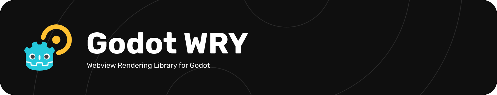
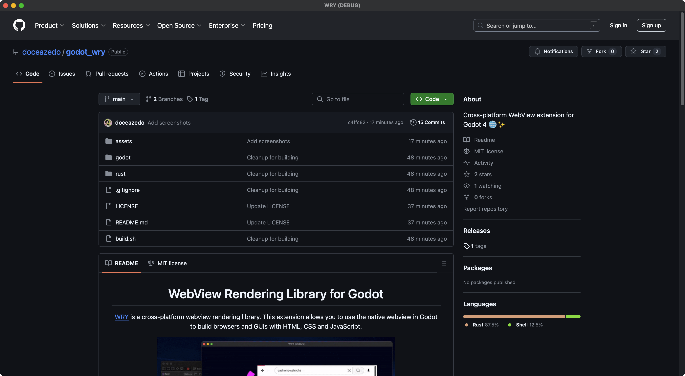

<a href="https://godotengine.org/asset-library/asset/3426">
  
</a>

<p align="center">
  
  
  <a href="https://discord.gg/B9fWw3raZJ">
    
  </a>
</p>

# Godot WRY

[WRY](https://github.com/tauri-apps/wry) is a cross-platform webview rendering library. This extension allows you to use the native webview in Godot to build browsers and GUIs with HTML, CSS and JavaScript.

## ✨ Features

- 🍃 Use the native system native webview (no extra dependencies!)
- 🌎 Load website URLs and local `res://` files
- 🧩 JavaScript ⇔ GDScript code integration
- 🚥 Mouse/keyboard input events forwarding

## ⛹️ Demo

<p align="center">
  
  Demo game UI available at "<a href="godot/addons/godot_wry/examples/character_creator_ui_demo">examples/character_creator_ui_demo</a>".
</p>

<details>
  <summary>📸 Other screenshots</summary>
  
  
  
  
  
  
</details>

## 💾 Installing

### Asset Library

The easiest way to install Godot WRY is through Godot's [Asset Library](https://godotengine.org/asset-library/asset/3426). You can install it via the editor by following these instructions:

1. Open your project in Godot 4.1 or later.
2. Go to the "📥 AssetLib" tab at the top of the editor.
3. Search for "Godot WRY".
4. Click on the Godot WRY extension and click **Download**.
5. In the configuration dialog, click **Install**.

### GitHub releases

1. Go to the [Releases](https://github.com/doceazedo/godot_wry/releases) page.
2. Download the latest release ZIP file (_not_ the source code).
3. Extract the contents into your project's "addons" folder (create one if it doesn't exist yet).

### Build from source

Use [just](https://github.com/casey/just) to build the extension and move the binaries to the Godot project folder:

```sh
$ just build
```

If you need a more in-depth guide on how to compile the project, check the [Building from source](https://godot-wry.doceazedo.com/contributing/compiling.html) documentation page.

## 📚 Documentation

Please refer to the [Docs](https://godot-wry.doceazedo.com) for API reference and in-depth guides on how to use Godot WRY.

## 🎯 Supported platforms

| Platform                        | Support        | Web engine                 |
| ------------------------------- | -------------- | -------------------------- |
| **Windows (10, 11)**            | ✅ Supported   | WebView2 (Chromium)        |
| **Mac (Intel, Apple Sillicon)** | ✅ Supported   | WebKit                     |
| **Linux (X11)**                 | 🚧 Supported\* | WebKitGTK                  |
| **Android**                     | ⏳ Planned     | Android WebView (Chromium) |
| **iOS**                         | ⏳ Planned     | WebKit                     |
| **Browser/HTML5**               | ⏳ Planned     | —                          |

### Linux

[WebKitGTK](https://webkitgtk.org) is required for WRY to function on Linux. The package name may differ based on the operating system and Linux distribution.

\* X11 support only. Transparency is currently not supported. See [#17](https://github.com/doceazedo/godot_wry/issues/17).

### Android/iOS

WRY itself already has [mobile support](https://github.com/tauri-apps/wry/blob/dev/MOBILE.md). Contributions to add Android/iOS support in this extension are welcome!

## ❌ Caveats

- Webview always renders on top
- Different browser engines across platforms
- No automatic dependency checks

You can learn more about these caveats on the [Caveats](https://godot-wry.doceazedo.com/about/caveats.html) documentation page.

## 🤝 Contribute

Your help is most welcome regardless of form! Check out the [How to contribute](https://godot-wry.doceazedo.com/contributing/how-to-contribute.html) page for all ways you can contribute to the project. For example, [suggest a new feature](https://github.com/doceazedo/godot_wry/issues/new?template=feature_request.md), [report a problem/bug](https://github.com/doceazedo/godot_wry/issues/new?template=bug_report.md), [submit a pull request](https://help.github.com/en/github/collaborating-with-issues-and-pull-requests/about-pull-requests), or simply use the project and comment your experience.

See the [Roadmap](https://godot-wry.doceazedo.com/about/roadmap.html) documentation page for an idea of how the project should evolve.

## 🎫 License

The Godot WRY extension is licensed under [MIT](/LICENSE). WRY is licensed under [Apache-2.0/MIT](https://github.com/tauri-apps/wry/blob/dev/LICENSE.spdx).

## 🧪 Similar projects

Below is a list of interesting similar projects:

- [gdcef](https://github.com/Lecrapouille/gdcef/tree/godot-4.x) — Open-source, powered by Chromium
- [Godot-HTML](https://github.com/Decapitated/Godot-HTML) — Open-source, powered by Ultralight (WebKit)
- [godot-webview](https://godotwebview.com/) — Commercial, powered by QT (Chromium/CEF)
