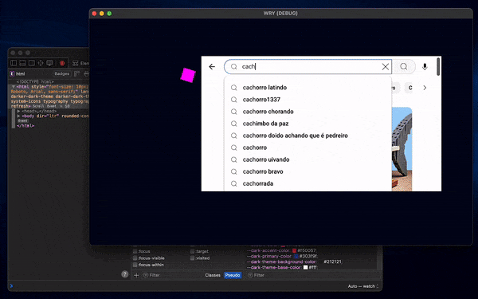

<h1 align="center">WebView Rendering Library for Godot</h1>

  <a href="https://github.com/tauri-apps/wry">WRY</a> is a cross-platform webview rendering library. This extension allows you to use the native webview in Godot to build browsers and GUIs with HTML, CSS and JavaScript.

  

## Download

> [!WARNING]  
> This extension is in active development and may be released soon.

## Getting started

After installing the extension, usage is as simple as adding a **Webview** node to your scene.

## Supported platforms

| Platform    | Support             | Web engine                 |
| ----------- | ------------------- | -------------------------- |
| **Windows** | 🔄 Work in progress | WebView 2 (Chromium)       |
| **Mac**     | ✅ Supported        | WebKit                     |
| **Linux**   | 🔄 Work in progress | WebKitGTK                  |
| **Android** | 🚧 Planned          | Android WebView (Chromium) |
| **iOS**     | 🚧 Planned          | WebKit                     |

### Windows

Transparency is not supported on Windows 7, and WebView2 support is limited to version 109 for Windows 7 and 8/8.1.

### Linux

WRY requires [WebKitGTK](https://webkitgtk.org). So you need to make sure it is properly installed beforehand.

### Android/iOS

WRY already has [mobile support](https://github.com/tauri-apps/wry?tab=readme-ov-file#android--ios). Contributions to implement Android and iOS are very welcome!
