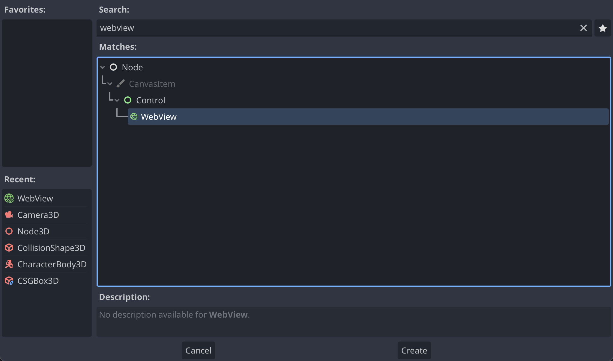

<a href="https://godotengine.org/asset-library/asset/3426">
  
</a>

<p align="center">
  
  
</p>

# Godot WRY

[WRY](https://godotengine.org/asset-library/asset/3426) is a cross-platform webview rendering library. This extension allows you to use the native webview in Godot to build browsers and GUIs with HTML, CSS and JavaScript.

> [!WARNING]  
> This extension is a work in progress! Expect bugs, report issues, and feel free to contribute.

## ✨ Features

- 🍃 Use the native system webview (no extra dependencies!)
- 🌎 Load website URLs and local `res://` files
- 🧩 JavaScript ⇔ GDScript code integration
- 🚥 Mouse/keyboard input events forwarding

<details>
  <summary><b>📸 Screenshots</b></summary>
  
  
  
  
  
  
</details>

## 💾 Downloading

### Asset Library

You can download the extension directly on the [Godot Asset Library](https://godotengine.org/asset-library/asset/3426) or by navigating to the "AssetLib" tab in the editor and searching for "wry".

### Releases

Alternatively, you can go to the [Releases](https://github.com/doceazedo/godot_wry/releases) page, download the latest ZIP (_not_ the source code) and import it manually into your project.

## 🎯 Supported platforms

| Platform                | Support             | Web engine                 |
| ----------------------- | ------------------- | -------------------------- |
| **Windows (10, 11)**    | ✅ Supported        | WebView2 (Chromium)        |
| **Mac (Apple Silicon)** | ✅ Supported        | WebKit                     |
| **Linux**               | 🔄 Work in progress | WebKitGTK                  |
| **Android**             | 🚧 Planned          | Android WebView (Chromium) |
| **iOS**                 | 🚧 Planned          | WebKit                     |
| **Browser/HTML5**       | 🚧 Planned          | —                          |

### Linux

WRY depends on [WebKitGTK](https://webkitgtk.org) to be installed to work on Linux.

### Android/iOS

WRY itself already has [mobile support](https://github.com/tauri-apps/wry/blob/dev/MOBILE.md). Contributions to add Android/iOS support in this extension are welcome!

## 🚀 Getting started

After installing the extension, you will now be able to see the **WebView** node inside `Node → CanvasItem → Control` when creating a new node. You can edit it's properties and layout as you wish.

|                        |                       |
| ----------------------------------------------------- | ---------------------------------------------- |
| <p align="center"><i>"Create new node" window</i></p> | <p align="center"><i>WebView inspector</i></p> |

## ⚡ API usage

### Interop between Webview and Godot

Godot and the webview can exchange messages with each other. This is useful for updating the UI data, or triggering game actions when interacting with the UI.

> 💡 **Example:** you can send a `play` message on a HTML button click, then Godot can listen for that message and start the game.

Sending messages from Godot to the webview:

```py
$WebView.post_message("Hello from Godot!")
```

Sending messages from JavaScript to Godot:

```js
window.ipc.postMessage("Hello from JavaScript!");
```

Receiving messages in Godot using the `ipc_message` signal:

```py
func _on_web_view_ipc_message(message):
	print("Just got a message from the webview: %s" % message)
```

Receiving messages in JavaScript using an event listener:

```js
document.addEventListener("message", (event) => {
  console.log("Just got a message from Godot:", event.detail);
});
```

### Evaluate JavaScript

You can also evaluate a JS script by using the `eval` API:

```py
# Log to the webview devtools
$WebView.eval("console.log(Math.PI)");
```

By using the interoperability API, you could even process asynchronous tasks with JavaScript, then get the result in GDScript later:

```py
func _on_button_pressed():
	$WebView.eval("
		const resp = await fetch('https://httpbin.org/ip');
		const data = await resp.json();
		ipc.postMessage(JSON.stringify(data));
	")

func _on_web_view_ipc_message(message):
	var data = JSON.parse_string(message)
	print("Your IP address is: %s" % data.origin)
```

## ❌ Caveats

- The webview is rendered directly within the window. This prevents rendering on 3D meshes and is always rendered on top of the game.
- Using the system's native WebView can lead to platform inconsistencies, like how a site behaves differently in Chrome vs. Safari.
- This extension doesn't check dependencies, so it's up to you to ensure they're installed and handle the missing libraries.

## 🤝 Contribute

Your help is most welcome regardless of form! Check out the [CONTRIBUTING.md](CONTRIBUTING.md) file for all ways you can contribute to the project. For example, [suggest a new feature](https://github.com/doceazedo/godot_wry/issues/new), [report a problem/bug](https://github.com/doceazedo/godot_wry/issues/new), [submit a pull request](https://help.github.com/en/github/collaborating-with-issues-and-pull-requests/about-pull-requests), or simply use the project and comment your experience.

See the [ROADMAP.md](ROADMAP.md) file for an idea of how the project should evolve.

## 🎫 License

The Godot WRY extension is licensed under [MIT](/LICENSE). WRY is licensed under [Apache-2.0/MIT](https://github.com/tauri-apps/wry/blob/dev/LICENSE.spdx).

## 🧪 Similar projects

Below is a list of interesting similar projects:

- [gdcef](https://github.com/Lecrapouille/gdcef/tree/godot-4.x) — Open-source, powered by Chromium
- [Godot-HTML](https://github.com/Decapitated/Godot-HTML) — Open-source, powered by Ultralight (WebKit)
- [godot-webview](https://godotwebview.com/) — Commercial, powered by QT (Chromium)
